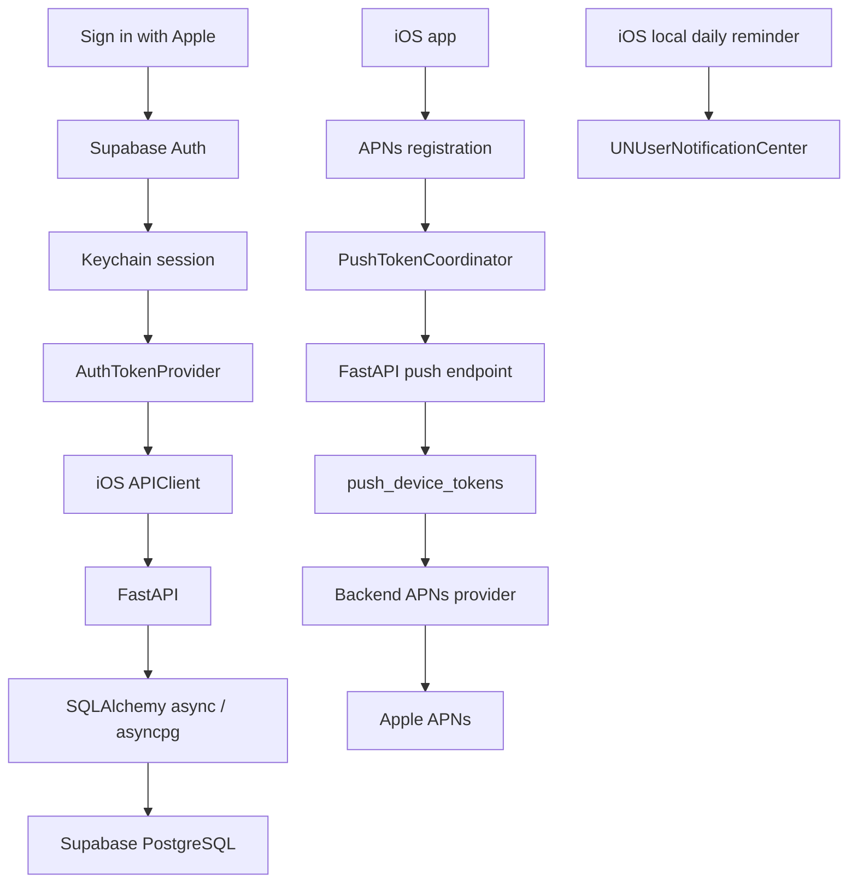

# Sa7tot Architecture

This document describes the current remote-only application architecture. The
implementation and migrations remain authoritative; see the [documentation
index](README.md) for related references.

## 4.1 System Overview

The main application flow is:



The iOS app uses Supabase directly for authentication and session management
only. Application and financial data are accessed through authenticated
FastAPI APIs. Supabase PostgreSQL is behind FastAPI, not a direct financial
database connection from iOS.

The current Development/Sandbox APNs foundation has been physically validated
end-to-end. Production APNs is not complete. The local daily notification
system remains separate from server/APNs push. Subscription reminder
scheduling is implemented for Development/Sandbox; notification tap routing is
not implemented.

## 4.2 Trust and Ownership Boundaries

### Authentication

Supabase Auth owns the authenticated identity and session. Sign in with Apple
provides the user authentication flow. iOS persists/restores the Supabase
session through Keychain-backed session storage.

### Application and financial API

FastAPI is the application-data boundary. Accounts, categories, movements,
transfers, budgets, subscriptions, and recurrences are read and mutated
through authenticated backend APIs.

### Database ownership

FastAPI validates the authenticated JWT and derives the application owner from
the authenticated subject. The client does not choose an arbitrary `user_id`.

PostgreSQL RLS constrains ordinary/direct role access. Privileged backend or
service-role access may bypass ordinary RLS enforcement, so FastAPI ownership
checks remain mandatory and RLS must not be treated as the only isolation
boundary.

## 4.3 iOS Application Layers

| Layer | Current responsibility | Source |
|---|---|---|
| App entry | Creates shared auth, remote-store, toast, and push-coordinator objects and injects them into the SwiftUI root | `app/Sa7tot/Sa7totApp.swift` |
| App delegate | Receives APNs registration callbacks and forwards them to the push coordinator; configures the scene delegate | `app/Sa7tot/AppDelegate.swift` |
| Auth root | Restores auth, observes auth transitions, starts bootstrap, selects login or authenticated content, and owns the root toast overlay | `app/Sa7tot/Views/AuthRootView.swift` |
| Auth service/session coordinator | Exchanges Apple credentials with Supabase Auth, restores/refreshes sessions, and performs auth sign-out | `app/Sa7tot/Remote/Auth/` |
| API client | Builds authenticated HTTP requests using a token from `AuthTokenProvider` | `app/Sa7tot/Remote/API/` |
| Financial store | Owns remote profile, accounts, categories, movements, budgets, subscriptions, recurrences, upcoming items, loading/error state, selection, and movement caches | `app/Sa7tot/Remote/Financial/FinancialRemoteStore.swift` |
| Push coordinator | Reconciles authorized APNs device tokens with the signed-in backend identity | `app/Sa7tot/Remote/Push/PushTokenCoordinator.swift` |
| Main SwiftUI views | Render Movimenti, Budget, Abbonamenti, Impostazioni, editors, and remote pickers from the shared store | `app/Sa7tot/Views/` |

## 4.4 Authentication and Bootstrap Lifecycle

The launch sequence is:

```text
launch
  → restore or establish authentication
  → observe signed-in state
  → load remote bootstrap/profile/data readiness
  → present the ready main application
```

`AuthRootView` uses the actual states `resolvingSession`,
`loadingRequiredData`, `ready`, `signedOut`, and `failed`. Being authenticated
is not the same as being application-data-ready. The remote bootstrap must
succeed before the main signed-in experience is considered ready.

See [Authentication Foundation](AUTHENTICATION_FOUNDATION.md) for the detailed
session, bearer-token, and sign-out lifecycle.

## 4.5 Financial Data Ownership

The backend owns persisted financial data and server-confirmed mutations for:

- Profiles and accounts.
- Categories.
- Transactions/movements and transfers.
- Budgets.
- Subscriptions.
- Recurrence rules and upcoming items.

The canonical subscription `next_billing_date` is stored on the backend
subscription record. Normal client creation calculates it from the billing
anchor/cadence; controlled initial-state, seed, and migration flows may supply
an initial date. `next_billing_date` is read-only in the update contract. When
schedule fields change during an update, the backend recalculates the next
date; otherwise it preserves the existing value. Due subscriptions are
materialized by backend services, which create the corresponding
occurrence/transaction and advance the next billing date.

Subscription materialization and recurrence materialization use idempotent
occurrence handling so repeated materialization does not create duplicate
financial records.

The iOS app supplies user input and renders server-confirmed DTOs. It does not
own a local financial database or a local Core Data/CloudKit fallback.

## 4.6 Client State and Cache Architecture

`FinancialRemoteStore` is the main observable state owner for remote financial
UI. It publishes profile, accounts, categories, selected account snapshots,
summaries, movement days, subscriptions, recurrence rules, upcoming items,
budget state, loading state, and errors.

Bootstrap is deduplicated through a shared task. It loads the profile, accounts,
and categories, normalizes the selected account, and resolves the initial
movement page. A remembered account ID is stored in standard user defaults for
selection continuity; it is not financial persistence.

Movement pages are cached by account and filter context. The cache key includes
the account, filter/type, selected day/week/month, and category where
applicable. The current store uses a 60-second freshness window and limits the
movement cache to 64 entries. During bootstrap, a fresh remembered-account
cache can be reused while authoritative bootstrap data is loaded.

Selecting an account changes the selected account, persists that selection, and
reloads the corresponding movement context. Refresh invalidates the selected
account cache, materializes recurrences where applicable, and fetches the first
page again. Mutations invalidate affected account caches and refresh the
server-confirmed state. Movement lists load additional pages through the
backend cursor when the last loaded row appears.

## 4.7 Critical UI Structural Invariants

These are structural arrangements with real regression risk, not pixel-level
styling requirements.

### Movimenti account pager

`RemoteAccountPager` is rendered in the upper content area of Movimenti before
the movement `LazyVStack`. It is not a child of the movement-row stack. The
pager owns horizontal account paging and account-selection handoff; moving it
into the deep movement list would reintroduce scroll, geometry, and collapse
regressions.

Source: `app/Sa7tot/Views/RemoteFinancialViews.swift`.

### Sticky day headers

Movement history uses a `LazyVStack` with `pinnedViews: [.sectionHeaders]`.
Each day is represented by a `Section` containing its rows and a day header.
This structure is intentional and should remain intact when changing row or
scroll behavior.

### Movement row effect

`MovementRecedingScrollEffect` is applied at the movement-row level in the
history list. It should remain row-scoped rather than becoming a whole-list or
whole-screen transform.

## 4.8 Notifications Architecture

There are two separate notification paths:

1. Local daily reminders use `NotificationSupport.swift` and
   `UNUserNotificationCenter`.
2. Server/APNs push uses `AppDelegate`, `PushTokenCoordinator`, the FastAPI
   push-device endpoints, `push_device_tokens`, and the backend APNs provider.

The Development/Sandbox push foundation is physically validated. The
server-side subscription reminder scheduler and privacy-conscious reminder
payload are implemented for Development/Sandbox; Production APNs and
notification tap/deep-link routing are not complete.

See [Push Notifications](push-notifications/README.md) for the current APNs
foundation and validation record.

## 4.9 Database and Migration Boundary

The backend uses SQLAlchemy models and services over async PostgreSQL access.
Alembic migrations define schema evolution, including RLS helpers/policies and
the `push_device_tokens` migration. Supabase PostgreSQL is the database
provider. The migration files, not this document, define the schema.

Relevant paths:

- `backend/app/models/`
- `backend/app/services/`
- `backend/app/core/database.py`
- `backend/alembic/versions/`

## 4.10 Critical Architecture Invariants

| Invariant | Why | Enforced by | Detailed document |
|---|---|---|---|
| FastAPI is the application-data boundary | Keeps financial ownership and validation server-side | iOS repositories/API client and FastAPI endpoints/services | This document; `backend/README.md` |
| Auth session is Keychain-backed | Allows secure relaunch restoration without storing session data in financial state | Supabase session coordinator/store | `AUTHENTICATION_FOUNDATION.md` |
| Signed-in is not data-ready | Prevents rendering an apparently ready app before bootstrap succeeds | `AuthRootView`, `FinancialRemoteStore.bootstrapIfNeeded()` | `AUTHENTICATION_FOUNDATION.md` |
| Push deactivation completes before auth clear | Prevents a signed-out account retaining an active device association | `PushTokenCoordinator`, Settings sign-out flow | `AUTHENTICATION_FOUNDATION.md`, push README |
| Push environment must match the build/token | Prevents Sandbox/Production token and endpoint mismatches | APNs configuration, token rows, backend APNs client | Push README |
| Backend owns subscription renewal calculation | Keeps renewal dates consistent across devices | subscription services and persisted `next_billing_date` | This document; backend source |
| Materialization is idempotent | Prevents duplicate transactions on retry or refresh | subscription/recurrence materializers and occurrence keys | Backend source |
| Account pager stays outside the movement-row stack | Prevents deep-scroll paging and collapse regressions | `RemoteFinancialViews.swift` layout | This document |
| Day sections keep pinned headers | Preserves date grouping and sticky navigation | `LazyVStack(pinnedViews: [.sectionHeaders])` | This document |

## 4.11 Source-of-Truth Paths

### App and authentication

- `app/Sa7tot/Sa7totApp.swift`
- `app/Sa7tot/Views/AuthRootView.swift`
- `app/Sa7tot/Remote/Auth/`
- `app/Sa7tot/Remote/API/`
- `app/Sa7tot/Remote/Financial/FinancialRemoteStore.swift`

### Push and local notifications

- `app/Sa7tot/AppDelegate.swift`
- `app/Sa7tot/Remote/Push/`
- `app/Sa7tot/Utilities/NotificationSupport.swift`
- `backend/app/api/v1/endpoints/push.py`
- `backend/app/services/apns.py`
- `backend/app/scripts/send_test_push.py`

### Backend and schema

- `backend/app/main.py`
- `backend/app/api/v1/router.py`
- `backend/app/api/v1/endpoints/`
- `backend/app/core/`
- `backend/app/models/`
- `backend/app/services/`
- `backend/alembic/versions/`

### Project configuration

- `app/Sa7tot.xcodeproj/project.pbxproj`
- `app/Sa7tot/Info.plist`
- `app/Sa7tot/Sa7tot.entitlements`
- `backend/pyproject.toml`
- `backend/.env.example`
